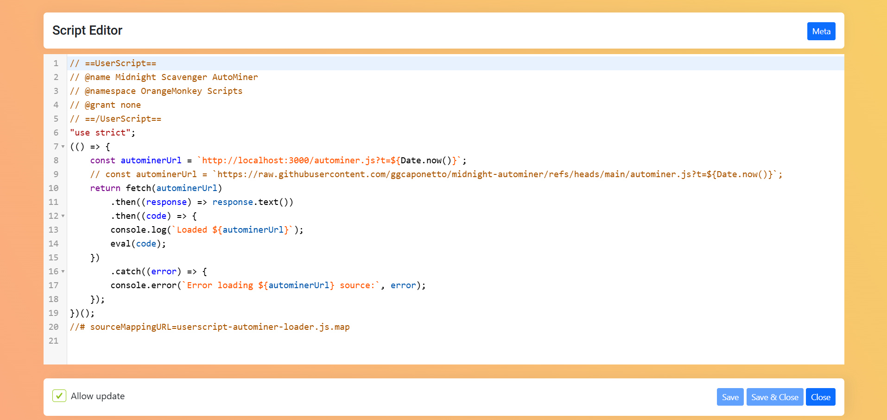
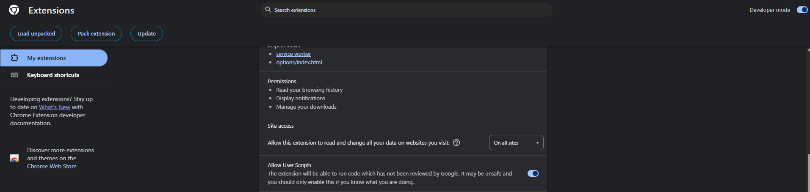

# Midnight Scavenger Mine Autoresume

[](https://forthebadge.com)

#### 💰 Send HOSKY or ADA if this helps you cheat a bit.

```
addr1q92jgkr25xczpawkjjdu83k76c57tunu7tqrlyw0gdv77h876ye8z00z7kupccs3ege8l73eg06a6363dme4yga06h7sqzdy35
```

Unfortunately the [https://sm.midnight.gd/wizard/mine](https://sm.midnight.gd/wizard/mine) website is
a bit flaky and unreliable. Manual tab reload is often needed because the mining unexpectedly stops or the challanges do not show up.

This repo hosts the userscript that can be added to [OrangeMonkey](https://chromewebstore.google.com/detail/orangemonkey/ekmeppjgajofkpiofbebgcbohbmfldaf?hl=en) or [TamperMonkey](https://www.tampermonkey.net/index.php) that will take care of the babysitting.



## Instructions [quick]

1. Install [OrangeMonkey](https://chromewebstore.google.com/detail/orangemonkey/ekmeppjgajofkpiofbebgcbohbmfldaf?hl=en)
2. Create a Custom Script like shown in the picture, where you copy paste the `dist\userscript-autominer-loader.js` file.


3. Configure OrangeMonkey

To make OrangeMonkey work in Chrome, do the following:

- Allow Userscripts
- Enable Developer mode toggle on the top right corner


